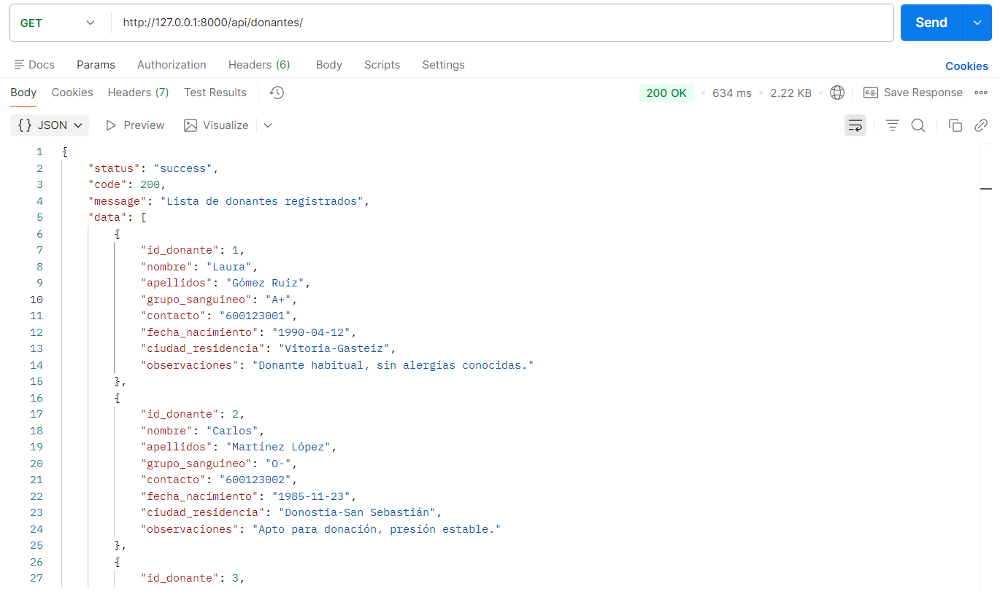
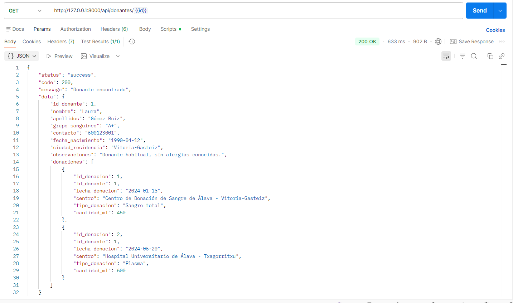
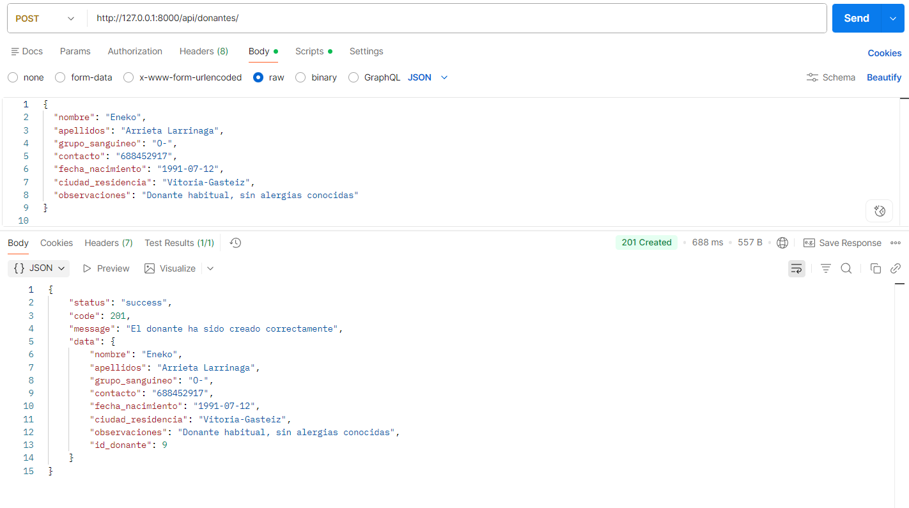
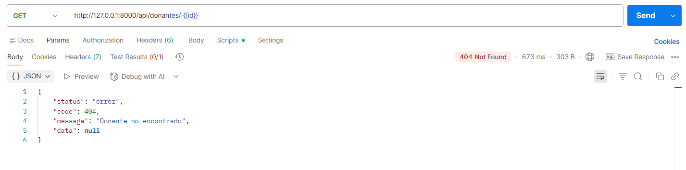

# 🚀 Donantes de sangre - Sistema de gestión de donantes


## 📖 Sobre el proyecto

**Sistema de gestión de donantes de sangre** es una API REST que desarrollé como parte de mi formación en **Desarrollo de Aplicaciones Web**. El proyecto permite gestionar donantes y sus donaciones, ofreciendo un CRUD completo con validaciones y respuestas JSON estructuradas.

*¿Por qué elegí este proyecto?* Quería aprender a desarrollar una API profesional con Laravel, implementar relaciones entre entidades (donantes y donaciones), y estandarizar respuestas JSON para que puedan ser consumidas por cualquier frontend.

## 🎯 Funcionalidades principales

### 📋 Gestión de donantes (CRUD completo)
- **GET /donantes** - Obtener todos los donantes
- **GET /donantes/{id}** - Obtener un donante con su historial de donaciones
- **POST /donantes** - Crear un nuevo donante con validaciones
- **PUT /donantes/{id}** - Actualizar datos de un donante
- **DELETE /donantes/{id}** - Eliminar un donante

### 💉 Gestión de donaciones
- **POST /donaciones** - Registrar una nueva donación asociada a un donante
- Validación manual que verifica la existencia del donante antes de crear la donación

### 📦 Formato de respuesta estandarizado
Todas las respuestas siguen la misma estructura:
```json
{
    "status": "success|error",
    "code": 200,
    "message": "Mensaje informativo",
    "data": { ... }
}
```

## 🛠️ Stack técnico

| Tecnología | Uso |
|------------|-----|
| Laravel 12 | Framework principal y API Gateway |
| PHP 8.2 | Lógica del servidor |
| Eloquent ORM | Consultas a base de datos sin SQL manual |
| MySQL | Base de datos relacional |
| Postman| Pruebas de endpoints |

## 📁 Arquitectura del proyecto

    donantes-sangre/
    ├── app/
    │   ├── Http/
    │   │   └── Controllers/
    │   │       └── DonanteController.php
    │   ├── Models/
    │   │   ├── Donante.php
    │   │   └── Donacion.php
    │   └── Utils/
    │       └── ApiResponse.php
    ├── routes/
    │   └── api.php
    ├── .env.example
    └── README.md


## 🚀 Instalación y uso
```bash
# Clonar el repositorio
git clone https://github.com/programs-w/donantes-api.git

cd donantes-sangre

# Copiar archivo de entorno
cp .env.example .env

# Configurar la base de datos en .env
# (Asegúrate de tener MySQL/MariaDB instalado y funcionando)
DB_DATABASE=donantes_bbdd
DB_USERNAME=root
DB_PASSWORD=

# Ejecutar el script SQL para crear las tablas
# Se incluye el archivo donantes_bbdd.sql con la estructura completa
# Importar en phpMyAdmin o ejecutar desde MySQL

# Instalar dependencias de PHP
composer install

# Iniciar el servidor
php artisan serve

# El servidor estará disponible en:
# http://127.0.0.1:8000

```
## 📸 Capturas de pantalla

### GET /donantes - Lista de donantes


### GET /donantes/{id} - Donante con sus donaciones


### POST /donantes - Crear donante


### Validación de errores


## 📊 Modelo de datos

### Tabla: donantes

| Campo             | Tipo           | Descripción                     |
|------------------|----------------|---------------------------------|
| id_donante       | INT            | Clave primaria                  |
| nombre           | VARCHAR(100)   | Nombre del donante              |
| apellidos        | VARCHAR(200)   | Apellidos                       |
| grupo_sanguineo  | VARCHAR(5)     | A+, O-, etc.                    |
| contacto         | VARCHAR(100)   | Email o teléfono (único)        |
| fecha_nacimiento | DATE           | Fecha de nacimiento             |
| ciudad_residencia| VARCHAR(100)   | Ciudad                          |

### Tabla: donaciones

| Campo          | Tipo          | Descripción                          |
|----------------|---------------|--------------------------------------|
| id_donacion    | INT           | Clave primaria                       |
| id_donante     | INT           | Clave foránea → donantes             |
| fecha_donacion | DATE          | Fecha de la donación                 |
| centro         | VARCHAR(100)  | Centro de donación                   |
| tipo_donacion  | VARCHAR(20)   | Sangre total, plasma, plaquetas      |
| cantidad_ml    | INT           | Cantidad donada en ml                |


## Endpoints de la API

| Método | Endpoint               | Descripción                     |
|--------|-------------------------|---------------------------------|
| GET    | /api/donantes          | Obtener todos los donantes      |
| GET    | /api/donantes/{id}     | Obtener donante por ID          |
| POST   | /api/donantes          | Crear nuevo donante             |
| PUT    | /api/donantes/{id}     | Actualizar donante              |
| DELETE | /api/donantes/{id}     | Eliminar donante                |
| POST   | /api/donaciones        | Crear nueva donación            |

## 🧪 Pruebas con Postman

Se incluye colección de Postman con todas las peticiones preconfiguradas para probar la API rápidamente.

## 💡 Competencias desarrolladas

- Desarrollo de API RESTful con Laravel siguiendo el patrón MVC

- Uso de Eloquent ORM para consultas a base de datos sin SQL manual

- Relaciones entre modelos (hasMany / belongsTo)

- Validación de datos y manejo de errores con códigos HTTP (200, 201, 400, 404, 422, 500)

- Estandarización de respuestas JSON (status, code, message, data)

- Persistencia de datos en MySQL

- Comunicación síncrona mediante peticiones HTTP